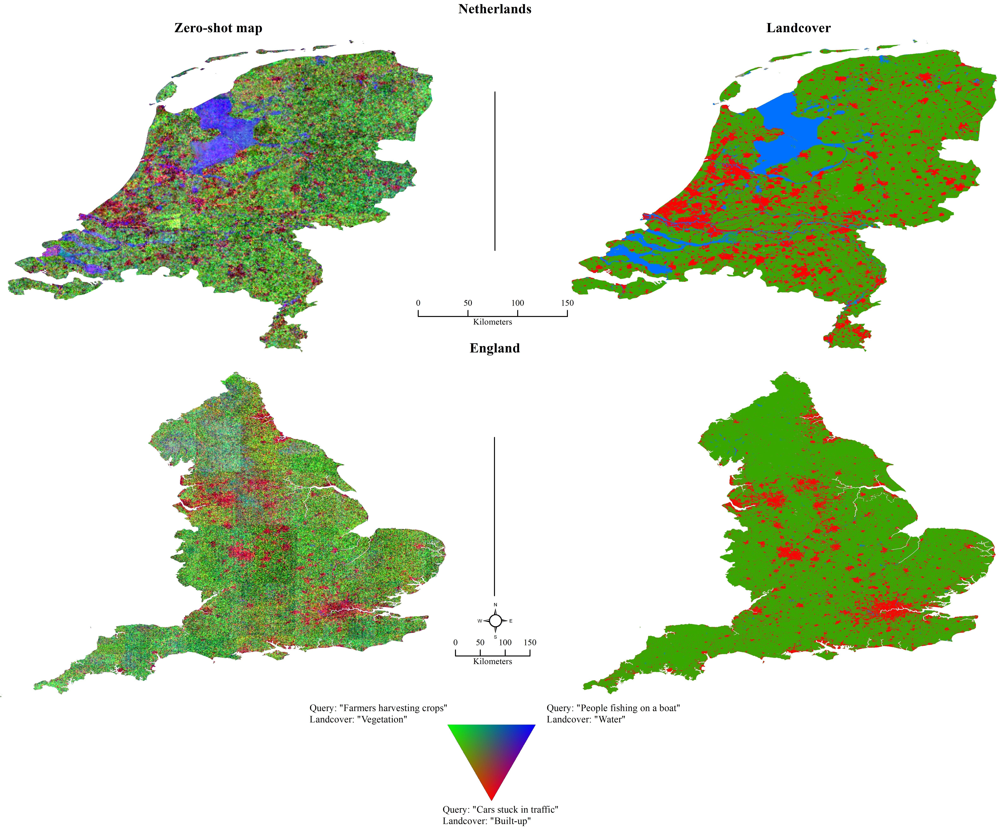

# Sat2Cap: Mapping Fine-grained Text Descriptions from Satellite Images
<div align="center">

  
[](https://arxiv.org/abs/2307.15904) </center>

[Aayush Dhakal*](https://scholar.google.com/citations?user=KawjT_8AAAAJ&hl=en),
[Adeel Ahmad](https://adealgis.wixsite.com/adeel-ahmad-geog)
[Subash Khanal](https://subash-khanal.github.io/),
[Srikumar Sastry](https://sites.wustl.edu/srikumarsastry/),
[Hannah Kerner](https://hannah-rae.github.io/)
[Nathan Jacobs](https://jacobsn.github.io/)
## 📑 Citation

```bibtex
@inproceedings{dhakal2024sat2cap,
  title={Sat2cap: Mapping fine-grained textual descriptions from satellite images},
  author={Dhakal, Aayush and Ahmad, Adeel and Khanal, Subash and Sastry, Srikumar and Kerner, Hannah and Jacobs, Nathan},
  booktitle={IEEE/ISPRS Workshop: Large Scale Computer Vision for Remote Sensing (EARTHVISION)},
  pages={533--542},
  year={2024}
}
```

## 🔍 Additional Links
Check out our lab website for other interesting works on geospatial understanding and mapping:
* Multi-Modal Vision Research Lab (MVRL) - [Link](https://mvrl.cse.wustl.edu/)
* Related Works from MVRL - [Link](https://mvrl.cse.wustl.edu/publications/)
