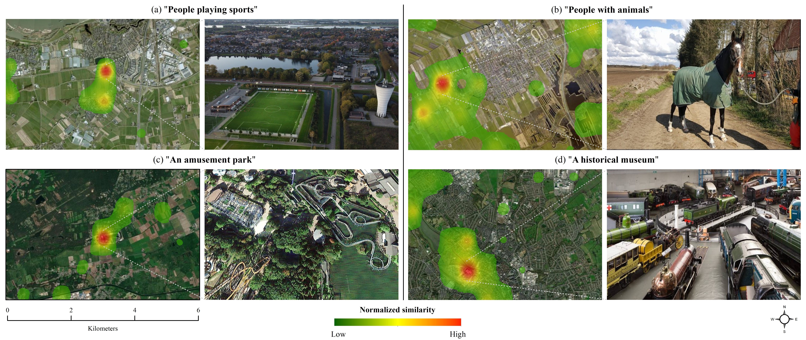

# Sat2Cap: Mapping Fine-grained Text Descriptions from Satellite Images
<div align="center">

  
[](https://arxiv.org/abs/2307.15904) </center>
[]()

[Aayush Dhakal*](https://scholar.google.com/citations?user=KawjT_8AAAAJ&hl=en),
[Adeel Ahmad](https://adealgis.wixsite.com/adeel-ahmad-geog)
[Subash Khanal](https://subash-khanal.github.io/),
[Srikumar Sastry](https://sites.wustl.edu/srikumarsastry/),
[Hannah Kerner](https://hannah-rae.github.io/)
[Nathan Jacobs](https://jacobsn.github.io/)
</div>

The repository is the official implementation of [Sat2Cap](https://openaccess.thecvf.com/content/CVPR2024W/EarthVision/html/Dhakal_Sat2Cap_Mapping_Fine-Grained_Textual_Descriptions_from_Satellite_Images_CVPRW_2024_paper.html)  [CVPRW, EarthVision 2024, Best Paper Award].
Sat2Cap model solves the mapping problem in a zero-shot approach. Instead of predicting pre-defined attributes for a satellite image, Sat2Cap attempts to learn the
text associated with a given location. 

## 🏋️‍♀️ Training
You can use the `run_geo.sh` script to train the Sat2Cap model. All the necessary hyperparameters can be set in the bash script.

## 🔮 Inference
Once you have the trained model use the `generate_map_embedding.py` file under evaluations to generate Sat2Cap embeddings for all images of interest. 
Use `merge_embeddings.py` to add location and temporal input to the generated embeddings. Finally, the `get_similarity.py` file generates similarity values for a given prompt. These similarity values can then be used to create zero-shot maps.

## 📑 Citation

## 

```bibtex
@inproceedings{dhakal2024sat2cap,
  title={Sat2cap: Mapping fine-grained textual descriptions from satellite images},
  author={Dhakal, Aayush and Ahmad, Adeel and Khanal, Subash and Sastry, Srikumar and Kerner, Hannah and Jacobs, Nathan},
  booktitle={IEEE/ISPRS Workshop: Large Scale Computer Vision for Remote Sensing (EARTHVISION)},
  pages={533--542},
  year={2024}
}
```

## 🔍 Additional Links
Check out our lab website for other interesting works on geospatial understanding and mapping:
* Multi-Modal Vision Research Lab (MVRL) - [Link](https://mvrl.cse.wustl.edu/)
* Related Works from MVRL - [Link](https://mvrl.cse.wustl.edu/publications/)
