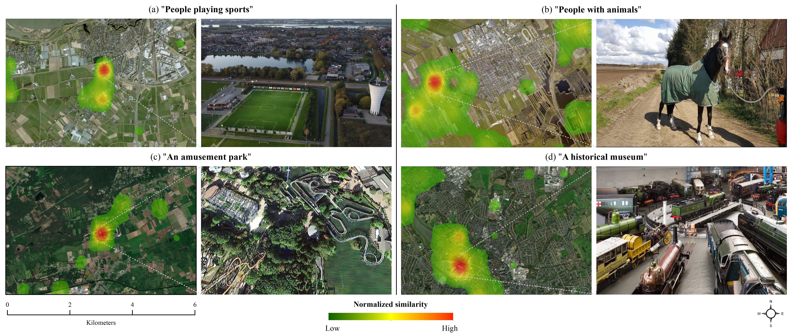

# Sat2Cap: Mapping Fine-grained Text Descriptions from Satellite Images
<div align="center">

  
[](https://arxiv.org/abs/2307.15904) </center>
[]()

[Aayush Dhakal*](https://scholar.google.com/citations?user=KawjT_8AAAAJ&hl=en),
[Adeel Ahmad](https://adealgis.wixsite.com/adeel-ahmad-geog)
[Subash Khanal](https://subash-khanal.github.io/),
[Srikumar Sastry](https://sites.wustl.edu/srikumarsastry/),
[Hannah Kerner](https://hannah-rae.github.io/),
[Nathan Jacobs](https://jacobsn.github.io/)
</div>

The repository is the official implementation of [Sat2Cap](https://openaccess.thecvf.com/content/CVPR2024W/EarthVision/html/Dhakal_Sat2Cap_Mapping_Fine-Grained_Textual_Descriptions_from_Satellite_Images_CVPRW_2024_paper.html)  [CVPRW, EarthVision 2024, Best Paper Award].
Sat2Cap model solves the mapping problem in a zero-shot approach. Instead of predicting pre-defined attributes for a satellite image, Sat2Cap attempts to learn the
text associated with a given location. 

## 🤗 Pretrained Models

Pretrained Sat2Cap models are available on HuggingFace:

**[MVRL Remote Sensing Foundation Models](https://huggingface.co/collections/MVRL/remote-sensing-foundation-models)**

You can load the pretrained model with a single function call:

```python
from sat2cap.utils.load_model import load_sat2cap

# Automatically downloads the checkpoint from HuggingFace Hub
model = load_sat2cap(repo_id='MVRL/sat2cap', filename='sat2cap.ckpt')
model.eval()
```

Or install `huggingface_hub` and download manually:

```bash
pip install huggingface_hub
```

```python
from huggingface_hub import hf_hub_download
ckpt_path = hf_hub_download(repo_id='MVRL/sat2cap', filename='sat2cap.ckpt')
```

## 🚀 Quick Start: Text-Image Similarity Demo

See [`demo.ipynb`](demo.ipynb) for a full walkthrough that shows how to:

1. Load the pretrained Sat2Cap model from HuggingFace
2. Preprocess a satellite image
3. Compute cosine similarity scores against a list of text prompts
4. Visualize the top-matching text descriptions for your satellite image

```python
import torch
from transformers import AutoTokenizer, CLIPTextModelWithProjection
from sat2cap.utils.load_model import load_sat2cap

device = torch.device('cuda' if torch.cuda.is_available() else 'cpu')

# Load pretrained model
model = load_sat2cap(repo_id='MVRL/sat2cap', filename='sat2cap.ckpt').to(device).eval()

# Load CLIP text encoder
tokenizer = AutoTokenizer.from_pretrained('openai/clip-vit-base-patch32')
text_model = CLIPTextModelWithProjection.from_pretrained('openai/clip-vit-base-patch32').to(device).eval()

# Define text prompts
prompts = ['a photo of a forest', 'a photo of a city center', 'a photo of farmland']

# Encode text prompts
with torch.no_grad():
    tokens = tokenizer(prompts, padding=True, return_tensors='pt').to(device)
    text_embeds = text_model(**tokens).text_embeds
    text_embeds = text_embeds / text_embeds.norm(p=2, dim=-1, keepdim=True)

# Encode a satellite image (supply your own image tensor preprocessed to 224x224)
# img_tensor shape: (1, 3, 224, 224)
with torch.no_grad():
    img_embeds, _ = model.imo_encoder(img_tensor)

# Compute cosine similarities
similarities = (img_embeds @ text_embeds.T).squeeze(0)
best_match = prompts[similarities.argmax()]
print(f'Best matching description: "{best_match}"')
```

## 🏋️‍♀️ Training
You can use the `run_geo.sh` script to train the Sat2Cap model. All the necessary hyperparameters can be set in the bash script.

## 🔮 Inference
Once you have the trained model use the `generate_map_embedding.py` file under evaluations to generate Sat2Cap embeddings for all images of interest. 
Use `merge_embeddings.py` to add location and temporal input to the generated embeddings. Finally, the `get_similarity.py` file generates similarity values for a given prompt. These similarity values can then be used to create zero-shot maps.

## 📑 Citation

```bibtex
@inproceedings{dhakal2024sat2cap,
  title={Sat2cap: Mapping fine-grained textual descriptions from satellite images},
  author={Dhakal, Aayush and Ahmad, Adeel and Khanal, Subash and Sastry, Srikumar and Kerner, Hannah and Jacobs, Nathan},
  booktitle={IEEE/ISPRS Workshop: Large Scale Computer Vision for Remote Sensing (EARTHVISION)},
  pages={533--542},
  year={2024}
}
```

## 📄 License

This project is licensed under the Apache License 2.0 — see the [LICENSE](LICENSE) file for details.

## 🔍 Additional Links
Check out our lab website for other interesting works on geospatial understanding and mapping:
* Multi-Modal Vision Research Lab (MVRL) - [Link](https://mvrl.cse.wustl.edu/)
* Related Works from MVRL - [Link](https://mvrl.cse.wustl.edu/publications/)
